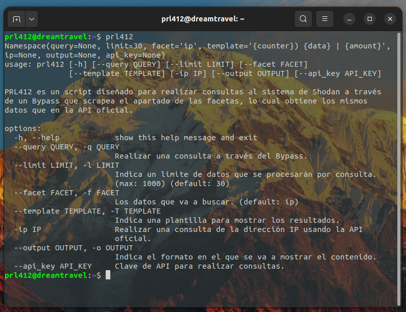

---

<h1>Security Spy 💣</h1>

⚠️ Este sistema fué desarrollado <b>únicamente por fines educativos</b>, no me hago responsable por el el uso inadecuado y poco ético de quien lo use. 

## Descripción 📝

Security Spy es un proyecto que se encarga de realizar <b>consultas a la página web oficial de Shodan</b> por medio del método GET a las facetas, con el objetivo de obtener hasta 1000 datos por cada consulta que se haga, lo que resulta ser una <i>alternativa a la API</i> de consultas de Shodan, facilitando la obtención de datos que en un momento, solo se podían obtener usando una API KEY.

<pre><code>
usage: Security Spy [-h] [--query QUERY] [--limit LIMIT] [--facet FACET]
              [--template TEMPLATE] [-ip IP] [--output OUTPUT] [--api_key API_KEY]

Security Spy es un script diseñado para realizar consultas al sistema de Shodan a través
de un Bypass que scrapea el apartado de las facetas, lo cual obtiene los mismos
datos que en la API oficial.

options:
  -h, --help            show this help message and exit
  --query QUERY, -q QUERY
                        Realizar una consulta a través del Bypass.
  --limit LIMIT, -l LIMIT
                        Indica un límite de datos que se procesarán por consulta.
                        (max: 1000) (default: 30)
  --facet FACET, -f FACET
                        Los datos que va a buscar. (default: ip)
  --template TEMPLATE, -T TEMPLATE
                        Indica una plantilla para mostrar los resultados.
  -ip IP                Realizar una consulta de la dirección IP usando la API
                        oficial.
  --output OUTPUT, -o OUTPUT
                        Indica el formato en el que se va a mostrar el contenido.
  --api_key API_KEY     Clave de API para realizar consultas.
</code></pre>

## Objetivos 🎯

Crear una alternativa gratuita a la <b>API de Shodan</b>, por medio de un scraper que recolecta información a través de las facetas que éste ofrece a través de su <a href="https://www.shodan.io/search/facet">página web de facetas</a>, lo que permite obtener exactamente los mismos datos que se obtiene al realizar una <b>consulta a la API de Shodan</b>, buscando fomentar el análisis en la seguridad informática, teniendo la capacidad de realizar consultas ilimitadas obteniendo hasta 1000 datos por consulta.

## Funcionalidades 💡

El sistema Security Spy cuenta con dos funcionalidades principales que buscan un enfoque gratuito y de calidad:
- <b>IPQuery:</b> Un sistema que se encarga de realizar consultas a la API de shodan (Es gratuito) con la API KEY del usuario.
- <b>Search:</b> Un scraper que realiza la consulta automáticamente a la página de las facetas de shodan.

## Requisitos 🛠️

- <code>shodan</code> Librería para la interacción con la API de Shodan.
- <code>rich</code> Librería para enviar mensajes con una estéticos.
- <code>bs4</code> Librería para el procesamiento de código HTML.

## Instalación 💻

Para instalar correctamente el script, sigue los siguientes pasos:

1) Clonar este repositorio:
    - <code>git clone https://github.com/TechAtlasDev/SecuritySpy</code>

 

2) Entrar al directorio:
    - <code>cd Security Spy</code>

 

3) Instalar python si no lo tienes instalado:
    - Para Ubuntu: <code>sudo apt install python3 -y</code>
    - Para Termux: <code>apt install python3 -y</code>

 

4) Instalar las dependencias y configurar el sistema Security Spy:
    - El setup es tan simple como poner el siguiente comando: <code>bash setup.sh</code>

 

5) Brindarle permisos de ejecución al sistema:
    - <code>chmod +x src/Security Spy</code>

## Compatibilidad 🔨

|   Entorno   | Es compatible | Probado en |
|:------------:|:------------:|:------------:|
|   Windows   |   ❌   |   ❌   |
|   Linux     |   ✅   |   ✅   |
|   Termux    |   ✅   |   ✅   |

## Idiomas 🗣️

|   Idioma   | Disponibilidad |
|:------------:|:------------:|
|   Español   |   ✅   |
|   Ingles     |   ❌   |

## Screenshot 📸

